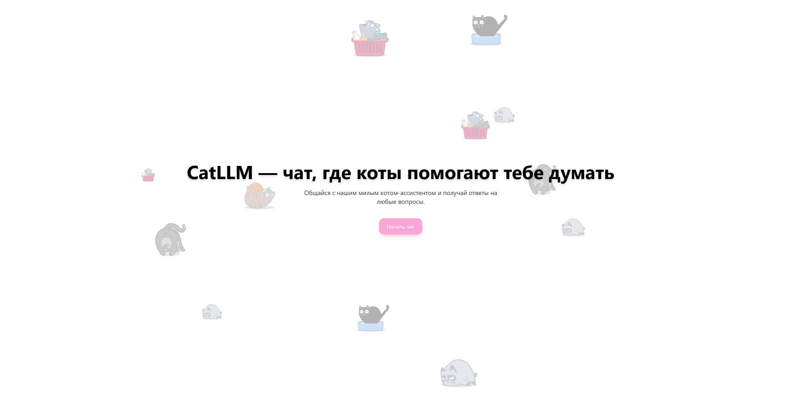
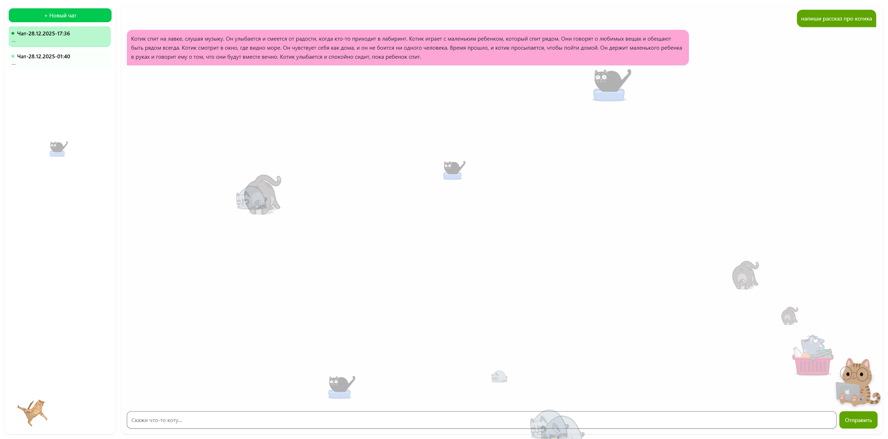

🐱 Team8 CatChat
---

##  Главная страница

##  Страница чата

## 🛠 Технологический стек

- **Frontend**: SvelteKit (Node.js, vite)
- **Backend**: REST API
- **Messaging**: Apache Kafka от bitnami
- **Database**: PostgreSQL
- **Containerization**: Docker
- **Orchestration**: Kubernetes
- **Package manager**: Helm
- **GitOps**: ArgoCD
- **Secrets**: Vault + External Secrets Operator
- **Autoscaling**: HPA
- **Ingress**: NGINX Ingress Controller

---
## 🛠 Архитектура решения (Argo) 

---
## ✅ Реализация требований

### 🔹 Несколько микросервисов
Используется более трёх сервисов:
- frontend
- backend
- llm-worker
- kafka

---

### 🔹 Развёртывание всех компонентов в Kubernetes
- Все компоненты развернуты через Helm
- Отдельные Deployment и Service

---

### 🔹 GitOps-деплой и CI/CD-пайплайн
- Docker-образы собираются в CI
- ArgoCD синхронизирует состояние кластера
- Конфигурация хранится в Git

---

### 🔹 Секреты и конфигурации
- Vault как централизованное хранилище секретов
- External Secrets Operator
- Секреты не хранятся в репозитории

---  

### 🔹 Взаимодействие между сервисами через Pub/Sub или gRPC  
- Kafka используется для передачи задач
- LLM Worker обрабатывает сообщения асинхронно
- Поддерживается SSE-стриминг ответов

---

### 🔹 Масштабирование и отказоустойчивость
- **HPA** для frontend и backend
- Backend доступен только внутри кластера

---